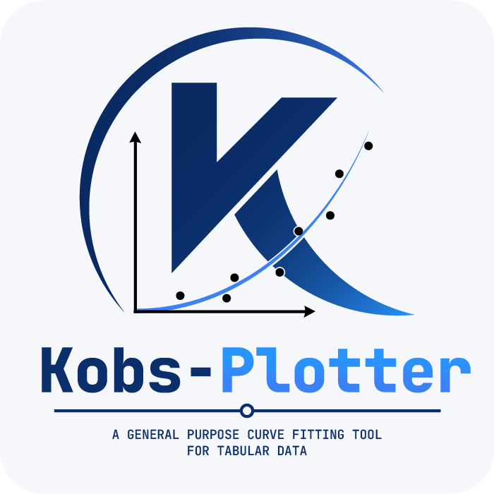
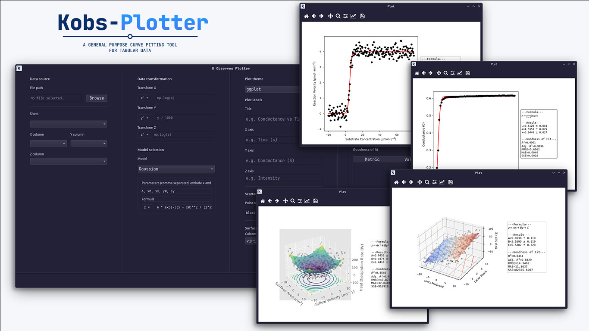
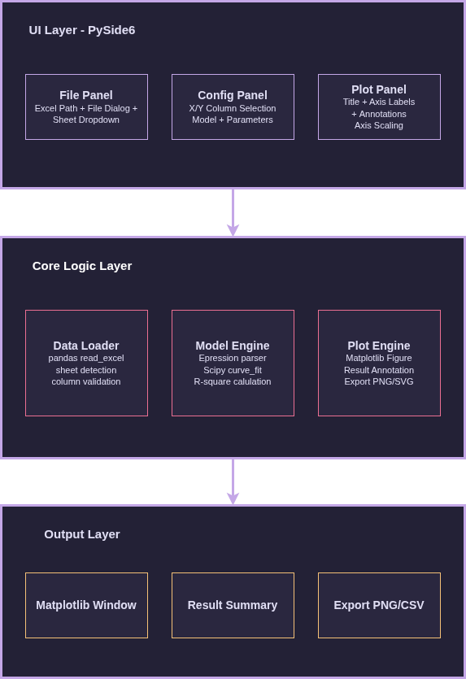

<p align="center">
  
</p>

<!-- TOC start (generated with https://github.com/derlin/bitdowntoc) -->

- [Kobs-Plotter](#kobs-plotter)
  - [System Architecture](#system-architecture)
  - [Installation](#installation)
    - [Recommended — install from GitHub](#recommended-install-from-github)
    - [Manual — install from source](#manual-install-from-source)
  - [Running the app](#running-the-app)
  - [Usage](#usage)
    - [1. Data Source](#1-data-source)
    - [2. Data Transformation *(optional)*](#2-data-transformation-optional)
    - [3. Model Selection](#3-model-selection)
      - [Custom model fields](#custom-model-fields)
    - [4. Plot Labels *(optional)*](#4-plot-labels-optional)
    - [5. Generating the plot](#5-generating-the-plot)
    - [6. Iterating](#6-iterating)
  - [Built with](#built-with)
  - [Citation](#citation)
    - [Citing dependencies](#citing-dependencies)

<!-- TOC end -->

<!-- TOC --><a name="kobs-plotter"></a>

# Kobs-Plotter

A general purpose curve fitting tool for tabular data. Load your Excel file,
select a model, and get fitted parameters with goodness-of-fit statistics — no
coding required.



<!-- TOC --><a name="system-architecture"></a>

## System Architecture



---

<!-- TOC --><a name="installation"></a>

## Installation

Kobs-Plotter is distributed as a command-line tool via **uv**. If you don't
have uv installed, follow the
[official installation guide](https://docs.astral.sh/uv/getting-started/installation/)
first — it takes under a minute.

<!-- TOC --><a name="recommended-install-from-github"></a>

### Recommended — install from GitHub

Open your terminal (PowerShell on Windows) and run:

```bash
uv tool install https://github.com/pdadhikary/kobs_plotter
```

That's it. uv handles all dependencies automatically.

<!-- TOC --><a name="manual-install-from-source"></a>

### Manual — install from source

Use this only if you want to modify the source code.

1. Download the latest release from the [Releases](https://github.com/pdadhikary/kobs_plotter/releases) page and extract the zip, or clone the repository:

```bash
   git clone https://github.com/pdadhikary/kobs_plotter.git
   cd kobs_plotter
```

1. Install the tool:

```bash
   uv tool install .
```

---

<!-- TOC --><a name="running-the-app"></a>

## Running the app

Once installed, launch the app from any terminal:

```bash
kobs-plotter
```

---

<!-- TOC --><a name="usage"></a>

## Usage

<!-- TOC --><a name="1-data-source"></a>

### 1. Data Source

Click **Browse** to select your Excel file. Once loaded, choose the **sheet**
where your data lives, then select the **X column** (independent variable) and
**Y column** (dependent variable) from the dropdowns.

---

<!-- TOC --><a name="2-data-transformation-optional"></a>

### 2. Data Transformation *(optional)*

You can preprocess your data before fitting using one-line
[NumPy expressions](https://numpy.org/doc/2.4/reference/index.html).

| Field | Description |
|---|---|
| `x' =` | Transformation applied to the X series |
| `y' =` | Transformation applied to the Y series |

**Example:** To fit a `ln(y)` vs `x` plot, leave `x' =` empty and set
`y' = np.log(y)`.

> **Note:** Use standard NumPy syntax here (e.g. `np.log(x)`, `np.sqrt(x)`).
> These fields accept any valid single-line NumPy expression.

---

<!-- TOC --><a name="3-model-selection"></a>

### 3. Model Selection

Choose a predefined model from the dropdown (Exponential, Linear, etc.), or
select **Custom** to define your own.

<!-- TOC --><a name="custom-model-fields"></a>

#### Custom model fields

**Parameters**

A comma-separated list of parameter symbols (everything except `x` and `y`).
You can optionally set initial values using `=`:

`A=np.min(y), B=np.max(y), k`

Parameters without an initial value (like `k` above) default to `1.0`.
Initial values can significantly impact fit quality — if the fit looks wrong,
try providing better starting estimates.

**Formula**

Define your model expression in standard mathematical notation:

`B - A * exp(-k * x)`

> **Important:** Do **not** use NumPy functions here (no `np.exp`, `np.log`
> etc.). Use plain mathematical functions — `exp`, `log`, `sqrt`, `sin`,
> `cos` — and the fitting engine handles the rest.

---

<!-- TOC --><a name="4-plot-labels-optional"></a>

### 4. Plot Labels *(optional)*

Customise the appearance of your output plot. All text fields support
LaTeX expressions for mathematical symbols —
see this [LaTeX reference](https://quickref.me/latex.html) for syntax.

| Field | Description |
|---|---|
| Title | Title displayed above the plot |
| X axis | X axis label |
| Y axis | Y axis label |
| Point color | Color of the scatter data points (e.g. `black`, `red`, `#FF5733`) |
| Line color | Color of the fitted trendline |
| Line style | Style of the trendline (see below) |

**Line styles:**

| Value | Style |
|---|---|
| `-` | Solid |
| `--` | Dashed |
| `-.` | Dash-dot |
| `:` | Dotted |

---

<!-- TOC --><a name="5-generating-the-plot"></a>

### 5. Generating the plot

The following fields are required before plotting:

- File path and sheet name
- X and Y columns
- Parameters and formula

Once all required fields are filled, press **Generate Plot**. A plot window
will open showing your data as scatter points with the fitted trendline
overlaid.

The **Parameters** and **Goodness of Fit** sections in the main window display
the results of the analysis — optimal parameter values, standard errors, R²,
adjusted R², RMSE, and more. These values can be selected and copied directly
into another file.

---

<!-- TOC --><a name="6-iterating"></a>

### 6. Iterating

You can modify any field at any time and press **Generate Plot** again — the
plot window updates in place without needing to restart. This makes it easy to
experiment with different models, transformations, or initial parameter values
without losing your other settings.

---

<!-- TOC --><a name="built-with"></a>

## Built with

| Library | Purpose |
|---|---|
| [PySide6](https://wiki.qt.io/Qt_for_Python) | GUI framework |
| [NumPy](https://numpy.org/) | Numerical operations and data transforms |
| [Pandas](https://pandas.pydata.org/) | Excel file loading |
| [SciPy](https://scipy.org/) | Curve fitting and statistics |
| [Matplotlib](https://matplotlib.org/) | Plot rendering |

---

<!-- TOC --><a name="citation"></a>

## Citation

If you use Kobs-Plotter in your research, please cite it as:

> Adhikary, P. D. (2026). Kobs-Plotter (Version 0.2.0) [Software].
> GitHub. <https://github.com/pdadhikary/kobs_plotter>

```bibtex
@software{adhikary2025kobsplotter,
    author       = {Adhikary, Prachurya Deepta},
    title        = {Kobs-Plotter: A desktop application for nonlinear curve fitting of tabular data},
    year         = {2026},
    publisher    = {GitHub},
    version      = {0.2.0},
    url          = {https://github.com/pdadhikary/kobs_plotter}
}
```

> **Note:** Please replace `year` with the year of the version you used,
> and add a `version` field with the specific release version from the
> [Releases](https://github.com/pdadhikary/kobs_plotter/releases) page.

<!-- TOC --><a name="citing-dependencies"></a>

### Citing dependencies

The following libraries underpin the core computation — many journals require
these to be cited alongside the software that uses them:

- **NumPy** — Harris, C.R., Millman, K.J., van der Walt, S.J. et al. Array programming with NumPy. Nature 585, 357–362 (2020). <https://doi.org/10.1038/s41586-020-2649-2>
- **SciPy** — Virtanen, P. et al. (2020). SciPy 1.0: Fundamental Algorithms for Scientific Computing in Python. *Nature Methods*, 17(3), 261–272. <https://doi.org/10.1038/s41592-019-0686-2>
- **Matplotlib** — J. D. Hunter, "Matplotlib: A 2D Graphics Environment", *Computing in Science & Engineering*, vol. 9, no. 3, pp. 90-95, 2007. <https://doi.org/10.5281/zenodo.20654446>
- **Pandas** — The pandas development team. Pandas-dev/pandas: Pandas. v3.0.3, Zenodo, 11 May 2026, <https://doi.org/10.5281/zenodo.20127038>.
